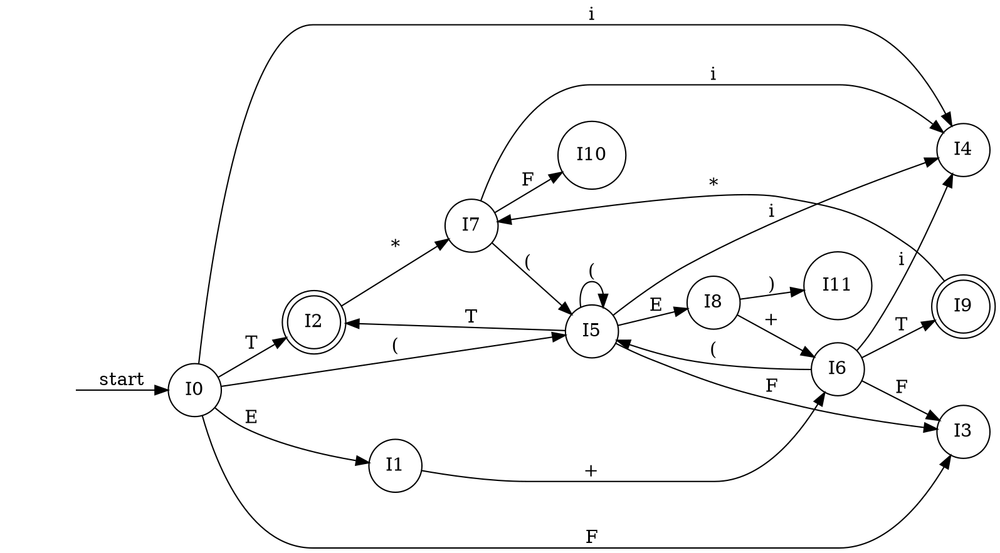

以下、過去の自分向けのメモの移動。

コンパイラの主要な処理に構文解析がある。
前回はLR0文法構文解析を行った。

今回は与えられたLALR(1)文法規則に基づいて構文解析するオートマトンを作り、構文解析の手法について整理する。

## 問題の文法規則

次のLALR(1)文法規則を受理するオートマトンと構文解析表をつくり、構文解析を行う。

```
E -> E + T
E -> T
T -> T * F
T -> F
F -> i
F -> ( E )
```

## First集合

### First集合とは

`First(K)` ... Kの還元前の終端記号列において、先頭に来る可能性のある終端記号の集合

### First集合の求め方

最初は空集合とする

#### 非終端記号

`First(K)` (`K`..非終端記号)について、
Kが左辺の文法規則が次の2つだったとき

- `K -> abc...`
- `K -> PqRs...`

`First(K) = First(K) + First(a) + First(P)`

#### 終端記号

`First(k)` (`k`...終端記号)について、
`First(k) = { k }`

### 今回の問題におけるFirst集合

`First(E) = First(T) = First(F) = { i ( }`

## Follow集合

### Follow集合とは

`Follow(K)` ... `K`の次に来る可能性のある終端記号の集合

### Follow集合の求め方

最初は`{}`
開始記号のFollow集合に$を加える

`Follow(K)`について

文法規則 `A -> wK` (`w`は任意の文字列)ならば
`Follow(K) += Follow(A) `

文法規則 `A -> wKB`かつ `First(B)∋ε` ならば
`Follow(K) += Follow(A)`

文法規則 `A -> xKy (y≠ε)` ならば
`Follow(K) += First(y)`

### 今回の問題におけるFollow集合

```
Follow(E) = { $ } + First( ) ) + First( + ) = { $ ) + }
Follow(T) = Follow(E) + First( * ) = { $ ) + * }
Follow(F) = Follow(T) = { $ ) + * }
```

## LALR(1)正準集合

### I0

```
E -> ・E + T [ $ + ]
E -> ・T [ $ + ]
T -> ・T * F [ $ + * ]
T -> ・F [ $ + * ]
F -> ・i [ $ + * ]
F -> ・( E ) [ $ + * ]
```

### I1

```
E -> E ・+ T [ $ + ]
```

### I2

```
E -> T・ [ $ + ) ]
T -> T ・* F [ $ + * ) ]
```

### I3

```
T -> F・ [ $ + * ) ]
```

### I4

```
F -> i・ [ $ + * ) ]
```

### I5

```
F -> ( ・E ) [ $ + * ) ]
E -> ・E + T [ + ) ]
E -> ・T [ + ) ]
T -> ・T * F [ + * ) ]
T -> ・F [ + * ) ]
F -> ・i [ + * ) ]
F -> ・( E ) [ + * ) ]
```

### I6

```
E -> E + ・T [ $ + ) ]
T -> ・T * F [ $ + * ) ]
T -> ・F [ $ + * ) ]
F -> ・i [ $ + * ) ]
F -> ・( E ) [ $ + * ) ]
```

### I7

```
T -> T * ・F [ $ + * ) ]
F -> ・i [ $ + * ) ]
F -> ・( E ) [ $ + * ) ]
```

### I8

```
F -> ( E ・) [ $ + * ) ]
E -> E ・+ T [ + ) ]
```

### I9

```
E -> E + T・ [ $ + ) ]
T -> T ・* F [ $ + * ) ]
```

### I10

```
T -> T * F・ [ $ + * ) ]
```

### I11

```
F -> ( E )・ [ $ + * ) ]
```

## オートマトン

以上より、与えられた文法規則を満たす系列を受理するオートマトンをつくる。



## 構文解析表

オートマトンを構文解析表にまとめる。

| I\記号 |  + |  * |  ( |  )  |  i |  $  | E | T |  F |
|:-------|----|----|----|-----|----|-----|---|---|----|
| 0      |    |    | s5 |     | s4 |     | 1 | 2 |  3 |
| 1      | s6 |    |    |     |    |     |   |   |    |
| 2      | r2 | s7 |    |  r2 |    | acc |   |   |    |
| 3      | r4 | r4 |    |  r4 |    |  r4 |   |   |    |
| 4      | r5 | r5 |    |  r5 |    |  r5 |   |   |    |
| 5      |    |    | s5 |     | s4 |     | 8 | 2 |  3 |
| 6      |    |    | s5 |     | s4 |     |   | 9 |  3 |
| 7      |    |    | s5 |     | s4 |     |   |   | 10 |
| 8      | s6 |    |    | s11 |    |     |   |   |    |
| 9      | r1 | s7 |    |  r1 |    | acc |   |   |    |
| 10     | r3 | r3 |    |  r3 |    |  r3 |   |   |    |
| 11     | r6 | r6 |    |  r6 |    |  r6 |   |   |    |

## 構文解析

上記の構文解析表に従い、次のような系列を構文解析する。

### `i+i*i`
```
( I0 , i+i*i$ ) // s6
( I0 i I4 , +i*i$ ) // r5
( I0 F I3 , +i*i$ ) // r4
( I0 T I2 , +i*i$ ) // r2
( I0 F I1 , +i*i$ ) // s6
( I0 F I1 + I6 , i*i$ ) // s4
( I0 F I1 + I6 i I4 , *i$ ) // r5
( I0 F I1 + I6 F I3 , *i$ ) // r4
( I0 F I1 + I6 T I9 , *i$ ) // s7
( I0 F I1 + I6 T I9 * I7 , i$ ) // s4 
( I0 F I1 + I6 T I9 * I7 i I4 , $ ) // r5 
( I0 F I1 + I6 T I9 * I7 F I10 , $ ) // r3 
( I0 F I1 + I6 T I9 , $ ) //  
```

### `i*(i+i)`

(略)

### ` i*i+*i`

(略)
