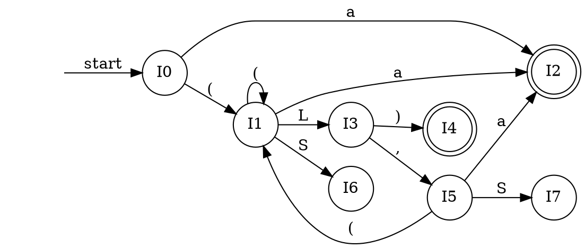

以下、過去の自分向けのメモの移動。

コンパイラの主要な処理に構文解析がある。
今回は与えられたLR(0)文法規則に基づいて構文解析するオートマトンを作り、構文解析の手法について整理する。

## 問題

次の文法について、次の問を答えよ

```
S -> ( L ) 
S -> a
L -> L , S
L -> S
```
上から順にR1,R2,R3,R4と呼ぶ。

ただし、SとLは非終端記号、(と)と,とaは終端記号とする。

- LR(0)正準集合とオートマトンを求めよ
- 以下の文字列が示された文法から生成されるかどうか、また構文解析の結果を答えよ

## LR(0)構文解析の方法

### LR(k)構文解析とは

- 上向き構文解析(下向きは再帰的に行うが、バックトラックが発生するため大変)
- 左(Left)から読み、右端導出(Right most derivation)
- kとは、先読みできる記号の数

### LR(0)構文解析の流れ

1. LR(0)正準集合とオートマトンをつくる
1. 構文解析表を作る
1. 構文解析表を元に解析する

### 方針: shiftまたはreduceを繰り返し、開始記号1つにまとまれば完了

- shift: 入力を1つ読み込むこと
- reduce: 文法規則を適用し、記号をまとめること

オートマトンの状態をスタックに積みながら、行う

shiftするときは、入力を読み込み、入力記号に従い有向辺を遷移する。遷移後の状態をスタックにpushする。

reduceするときは、適用する文法規則に則って、いままでの遷移を巻き戻し(スタックを記号数分popし)、適用後の記号の遷移を積み直す(pushする)。

オートマトンを表にまとめ、情報を更かして、shift、reduceの手順を示したのが構文解析表である。

## LR(0)におけるオートマトンの作成

### 前提

#### LR(0)項とは ... (アイテム記法)

文法規則の右辺、各記号の前後1箇所に・(ドット)を加えたもの。例えば`S -> ( ・L )`といった表記

これは、ドットの前方は読み込み済みであること、ドットの後方は未読み込みであることを示す。

(読み込むとは、ドットを1つ右に移動させること(ドットが1つ右のLR(0)項を含む状態に遷移すること(後術)であって、ドットの次が何の値であるか確認することではない)。

#### LR(0)正準集合とは

LR(0)項の集合である。
オートマトンを作成する際に一緒に作成する。

#### LR(0)におけるオートマトンとは

LR(0)正準集合を状態、記号を1つもつ有向辺としたオートマトン。

### LR(0)におけるオートマトンを作成する方法

#### 1. 初期状態を定める

状態には開始記号が左辺で、ドットが最左なLR(0)項をすべて含む。
(※)を行う。

#### 2. その他の状態を定める

既に存在する状態のドットが最右にないLR(0)項について、記号を一つ読み込んだ状態を新たにつくる。

遷移の有向辺には、読み込む記号をもたせる。
遷移後の状態は、記号を1つ読み込んだLR(0)項(ドットを1記号分右にずらしたLR(0)項)を含む。

さらに、遷移前の状態の他のLR(0)項について考える。
同じ記号を読み込める物があれば(遷移前のLR(0)項同士でドットの右隣の記号が一致すれば)、このLR(0)項についても、1記号読み込み後のLR(0)項を遷移後の状態に加える。

(※)を行う。

#### 3. 繰り返す

行える限り 2. を行う。

#### (※)

ある状態について、この状態に含むLR(0)項を考える。

ドットの右隣に非終端記号のあるLR(0)項があるならば、その終端記号を左辺に持ちドットが最左であるLR(0)項をすべて同じ状態に加える。

### 作成したオートマトン


#### 状態遷移表



#### 状態I0

- `S -> ・( L )`
- `S -> ・a`

#### 状態I1

- `S -> ( ・L )` (・の右隣に非終端記号)
- `L -> ・L , S`
- `L -> ・S` (・の右隣に非終端記号)
- `S -> ・( L )`
- `S -> ・a`

#### 状態I2

- `S -> a ・`

#### 状態I3

- `S -> ( L ・)`
- `L -> L ・, S`

#### 状態I4

- `S -> ( L ) ・`

#### 状態I5

- `L -> L , ・S` (・の右隣に非終端記号)
- `S -> ・( L )`
- `S -> ・a`

#### 状態I6

- `L -> S ・`

#### 状態I7

- `L -> L , S ・`

## 構文解析表

現在の状態(スタックのトップ)の行、入力記号(読み込み前)の列のセルに、次の動作を書いた表。

次の動作とは、次のようなものである。

- shiftするかreduceするか
- shiftならどの状態に遷移するか
- reduceならどの文法規則を適用するか

### 構文解析表のつくりかた

#### 1. 縦軸のラベル

縦軸にLR(0)正準集合を置く 

#### 2. 横軸のラベル

横軸に記号を置く。(このとき、終端記号と非終端記号は分ける、。終端記号に$(入力の終了を表す)を加える)

#### 3. shift

遷移元の状態を行、遷移時の終端記号を列とするセルに、skと書き込む。(状態Ikに遷移する)

shift(入力を1つ読み込む)して、スタックにkを積む(状態Ikに遷移する)ことを表す。

#### 4. reduce時のpushする(積み直す)状態

遷移元の状態を行、遷移時の非終端記号を列とするセルに、kと書き込む。(状態Ikに遷移する)

reduce時、還元後の状態(文法規則の左辺)をスタックに積み直す動作を表す。

#### 5. reduce時の適用する文法規則

最右がドットであるLR(0)項を含む状態の行、終端記号の列にrkと書き込む。(文法規則Rkを適用する)

#### 6. 完了状態

左辺が開始記号で右辺のドットが最右であるLR(0)項を含む状態の行
、$(入力終了)の列のセルに、accと書き込む。

accを参照したら構文が正しいことが示され、構文解析を終了する。

### 構文解析表の作成結果

今回の構文解析表は次の通り

| I\記号 |  ( |  ) |  , |  a |  $  |  S |  L |
|:-------|----|----|----|----|-----|----|----|
| 0      | s1 |    |    | s2 |     |    |    |
| 1      | s1 |    |    | s2 |     |  6 |  3 |
| 2      | r2 | r2 | r2 | r2 | acc |    |    |
| 3      |    | s4 | s5 |    |     |    |    |
| 4      | r1 | r1 | r1 | r1 | acc |    |    |
| 5      | s1 |    |    | s2 |     |  7 |    |
| 6      | r4 | r4 | r4 | r4 |     |    |    |
| 7      | r3 | r3 | r3 | r3 |     |    |    |

### 余談:構文解析表が表すもの

構文解析表の持つ情報は、次の3つに分けられる

#### 1. オートマトンの状態遷移表

| I\記号 | ( | ) | , | a | S | L |
|:-------|---|---|---|---|---|---|
| 0      | 1 |   |   | 2 |   |   |
| 1      | 1 |   |   | 2 | 6 | 3 |
| 2      |   |   |   |   |   |   |
| 3      |   | 4 | 5 |   |   |   |
| 4      |   |   |   |   |   |   |
| 5      | 1 |   |   | 2 |   | 7 |
| 6      |   |   |   |   |   |   |
| 7      |   |   |   |   |   |   |

#### 2. reduce可能状態と適用する文法規則

I2のとき、文法規則R2を適用する。
I4のとき、文法規則R1を適用する。
I6のとき、文法規則R4を適用する。
I3のとき、文法規則R3を適用する。

#### 3. 完了状態

I2,I4で全て読み込み済みのとき、構文解析が完了する。

## 構文解析

状態を記録するスタックを用意して、スタックトップと次の入力をもとに、動作を行う。

### 構文解析の方法

#### 1. 初期状態Ikであるとき、kをスタックに積む
#### 2. スタックtopの状態の行、次の入力記号の列のセルの指示に従う

##### sk

shiftする。

- 入力を読み取る。(次の動作のとき入力を次の終端記号にすすめる)
- スタックにkを積む

(オートマトンにおいて、入力の終端記号を辺とする状態遷移を行う)

##### rk

文法規則Rkに従ってreduceする。

- 文法Rkを適用することを記録する。
- 文法Rkの右辺の記号数分、スタックをpopする。(状態遷移を巻き戻す)
- 上行のpop後のスタックトップの状態を行、文法Rkの左側の記号を列とするセルの数字をスタックにpushする。(文法Rk左側の記号の状態遷移を積み直す)

##### acc

構文解析は成功。入力の分は、与えられた文法規則から生成される。
構文解析を終了する。

適用すべき文法規則とその順は、記録された文法規則Rkを順に読む。

##### 空

構文解析は失敗。入力の文は、与えられた文法規則から生成されることはない。

### 構文解析の結果

次の文を構文解析する。

上から順に、解析の経過を記す。

#### `((a,a),a)`

| 入力 | スタックtop |  操作 | スタック | 読み取り済み | 還元後 |  文法規則 | 補足 |
|:-----|-------------|-------|:---------|:-------------|:-------|:----------|:-----|
|      |             |       | 0        |              |        |           |      |
| (    | 0           |   s1  | 01       | (            | (      |           |      |
| (    | 1           |   s1  | 011      | ((           | ((     |           |      |
| a    | 1           |   s2  | 0112     | ((a          | ((a    |           |      |
| ,    | 2           |   r2  | 0116     | ((a          | ((S    | 2         |      |
| ,    | 6           |   r4  | 0113     | ((a          | ((L    | 24        |      |
| ,    | 3           |   s5  | 01135    | ((a,         | ((L,   | 24        |      |
| a    | 5           |   s2  | 011352   | ((a,a        | ((L,a  | 24        |      |
| )    | 2           |   r2  | 011357   | ((a,a        | ((L,S  | 242       |      |
| )    | 7           |   r3  | 0113     | ((a,a        | ((L    | 2423      |      |
| )    | 3           |   s4  | 01134    | ((a,a)       | ((L)   | 2423      |      |
| ,    | 4           |   r1  | 016      | ((a,a)       | (S     | 24231     |      |
| ,    | 6           |   r4  | 013      | ((a,a)       | (L     | 242314    |      |
| ,    | 3           |   s5  | 0135     | ((a,a),      | (L,    | 242314    |      |
| a    | 5           |   s2  | 01352    | ((a,a),a     | (L,a   | 242314    |      |
| )    | 2           |   r2  | 01357    | ((a,a),a     | (L,S   | 2423142   |      |
| )    | 7           |   r3  | 013      | ((a,a),a     | (L     | 24231423  |      |
| )    | 3           |   s4  | 0134     | ((a,a),a)    | (L)    | 24231423  |      |
| $    | 4           |  acc  | 0134     | ((a,a),a)$   | S      | 242314231 | accのときも文法規則r1は適用する。 |

以上より、与えられた文は、問題の文法規則から生成されることが示された。


#### `((a,a),(a,a))`

| 入力 | スタックtop |  操作 | スタック | 読み取り済み  |  還元後 |     文法規則   | 補足 |
|:-----|-------------|-------|:---------|:--------------|:--------|:---------------|:-----|
|      |             |       | 0        |               |         |                |      |
| (    | 0           |   s1  | 01       | (             | (       |                |      |
| (    | 1           |   s1  | 011      | ((            | ((      |                |      |
| a    | 1           |   s2  | 0112     | ((a           | ((a     |                |      |
| ,    | 2           |   r2  | 0116     | ((a           | ((S     | 2              |      |
| ,    | 6           |   r4  | 0113     | ((a           | ((L     | 24             |      |
| ,    | 3           |   s5  | 01135    | ((a,          | ((L,    | 24             |      |
| a    | 5           |   s2  | 011352   | ((a,a         | ((L,a   | 24             |      |
| )    | 2           |   r2  | 011357   | ((a,a         | ((L,S   | 242            |      |
| )    | 7           |   r3  | 0113     | ((a,a         | ((L     | 2423           |      |
| )    | 3           |   s4  | 01134    | ((a,a)        | ((L)    | 2423           |      |
| ,    | 4           |   r1  | 016      | ((a,a)        | (S      | 24231          |      |
| ,    | 6           |   r4  | 013      | ((a,a)        | (L      | 242314         |      |
| ,    | 3           |   s5  | 0135     | ((a,a),       | (L,     | 242314         |      |
| (    | 5           |   s1  | 01351    | ((a,a),(      | (L,(    | 242314         |      |
| a    | 1           |   s2  | 013512   | ((a,a),(a     | (L,(a   | 242314         |      |
| ,    | 2           |   r2  | 013516   | ((a,a),(a     | (L,(S   | 2423142        |      |
| ,    | 6           |   r4  | 013513   | ((a,a),(a     | (L,(L   | 24231424       |      |
| ,    | 3           |   s5  | 0135135  | ((a,a),(a,    | (L,(L,  | 24231424       |      |
| a    | 5           |   s2  | 01351352 | ((a,a),(a,a   | (L,(L,a | 24231424       |      |
| )    | 2           |   r2  | 01351357 | ((a,a),(a,a   | (L,(L,S | 242314242      |      |
| )    | 7           |   r3  | 013516   | ((a,a),(a,a   | (L,(S   | 2423142423     |      |
| )    | 6           |   r4  | 013513   | ((a,a),(a,a   | (L,(L   | 24231424234    |      |
| )    | 3           |   s4  | 0135134  | ((a,a),(a,a)  | (L,(L)  | 24231424234    |      |
| )    | 4           |   r1  | 01357    | ((a,a),(a,a)  | (L,S    | 242314242341   |      |
| )    | 7           |   r3  | 013      | ((a,a),(a,a)  | (L      | 2423142423413  |      |
| )    | 3           |   s4  | 0134     | ((a,a),(a,a)) | (L)     | 2423142423413  |      |
| $    | 4           |  acc  | 0        | ((a,a),(a,a)) | S       | 24231424234131 | accのときも文法規則r1は適用する。 |

以上より、与えられた文は、問題の文法規則から生成されることが示された。

#### `(a,(a,a),a)`

| 入力 | スタックtop |  操作 | スタック | 読み取り済み |  還元後 |  文法規則  | 補足 |
|:-----|-------------|-------|:---------|:-------------|:--------|:-----------|:-----|
|      |             |       | 0        |              |         |            |      |
| (    | 0           |   s1  | 01       | (            | (       |            |      |
| a    | 1           |   s2  | 012      | (a           | (a      |            |      |
| ,    | 2           |   r2  | 016      | (a           | (S      |            |      |
| ,    | 6           |   r4  | 013      | (a           | (L      | 4          |      |
| ,    | 3           |   s5  | 0135     | (a,          | (L,     | 4          |      |
| (    | 5           |   s1  | 01351    | (a,(         | (L,(    | 4          |      |
| a    | 1           |   s2  | 013512   | (a,(a        | (L,(a   | 4          |      |
| ,    | 2           |   r2  | 013516   | (a,(a        | (L,(S   | 42         |      |
| ,    | 6           |   r4  | 013513   | (a,(a        | (L,(L   | 424        |      |
| ,    | 3           |   s5  | 0135135  | (a,(a,       | (L,(L,  | 424        |      |
| a    | 5           |   s2  | 01351352 | (a,(a,a      | (L,(L,a | 424        |      |
| )    | 2           |   r2  | 01351357 | (a,(a,a      | (L,(L,S | 4242       |      |
| )    | 7           |   r3  | 013513   | (a,(a,a      | (L,(L   | 42423      |      |
| )    | 3           |   s4  | 0135134  | (a,(a,a)     | (L,(L)  | 42423      |      |
| ,    | 4           |   r1  | 01357    | (a,(a,a)     | (L,S    | 424231     |      |
| ,    | 7           |   r3  | 013      | (a,(a,a)     | (L      | 4242313    |      |
| ,    | 3           |   s5  | 0135     | (a,(a,a),    | (L,     | 4242313    |      |
| a    | 5           |   s2  | 01352    | (a,(a,a),a   | (L,a    | 4242313    |      |
| )    | 2           |   r2  | 01357    | (a,(a,a),a   | (L,S    | 42423132   |      |
| )    | 7           |   r3  | 013      | (a,(a,a),a   | (L      | 424231323  |      |
| )    | 3           |   s4  | 0134     | (a,(a,a),a)  | (L)     | 424231323  |      |
| $    | 4           |  acc  | 0        | (a,(a,a),a)  | S       | 4242313231 |      |

#### `(((a,a),a),a)`

| 入力 | スタックtop |  操作 | スタック  | 読み取り済み  | 還元後 |   文法規則   | 補足 |
|:-----|-------------|-------|:----------|:--------------|:-------|:-------------|:-----|
|      |             |       | 0         |               |        |              |      |
| (    | 0           |   s1  | 01        | (             | (      |              |      |
| (    | 1           |   s1  | 011       | ((            | ((     |              |      |
| (    | 1           |   s1  | 0111      | (((           | (((    |              |      |
| a    | 1           |   s2  | 01112     | (((a          | (((a   |              |      |
| ,    | 2           |   r2  | 01116     | (((a          | (((S   | 2            |      |
| ,    | 6           |   r4  | 01113     | (((a          | (((L   | 24           |      |
| ,    | 3           |   s5  | 011135    | (((a,         | (((L,  | 24           |      |
| a    | 5           |   s2  | 0111352   | (((a,a        | (((L,a | 24           |      |
| )    | 2           |   r2  | 0111357   | (((a,a        | (((L,S | 242          |      |
| )    | 7           |   r3  | 01113     | (((a,a        | (((L   | 2423         |      |
| )    | 3           |   s4  | 011134    | (((a,a)       | (((L)  | 2423         |      |
| ,    | 4           |   r1  | 0116      | (((a,a)       | ((S    | 24231        |      |
| ,    | 6           |   r4  | 0113      | (((a,a)       | ((L    | 242314       |      |
| ,    | 3           |   s5  | 01135     | (((a,a),      | ((L,   | 242314       |      |
| a    | 5           |   s2  | 011352    | (((a,a),a     | ((L,a  | 242314       |      |
| )    | 2           |   r2  | 011357    | (((a,a),a     | ((L,S  | 2423142      |      |
| )    | 7           |   r3  | 0113      | (((a,a),a     | ((L    | 24231423     |      |
| )    | 3           |   s4  | 01134     | (((a,a),a)    | ((L)   | 24231423     |      |
| ,    | 4           |   r1  | 013       | (((a,a),a)    | (L     | 242314231    |      |
| ,    | 3           |   s5  | 0135      | (((a,a),a),   | (L,    | 242314231    |      |
| a    | 5           |   s2  | 01352     | (((a,a),a),a  | (L,a   | 242314231    |      |
| )    | 2           |   r2  | 01357     | (((a,a),a),a  | (L,S   | 2423142312   |      |
| )    | 7           |   r3  | 013       | (((a,a),a),a  | (L     | 24231423123  |      |
| )    | 3           |   s4  | 0134      | (((a,a),a),a) | (L)    | 24231423123  |      |
| $    | 4           |  acc  | 0         | (((a,a),a),a) | S      | 242314231231 |      |

以上より、与えられた文は、問題の文法規則から生成されることが示された。

<style>
.article.markdown-body table th {
  min-width: 0px;
}
.article.markdown-body table td {
  min-width: 0px;
}
</style>
