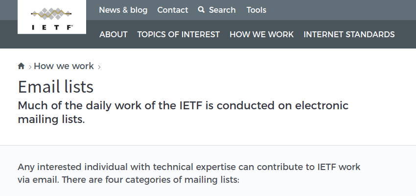
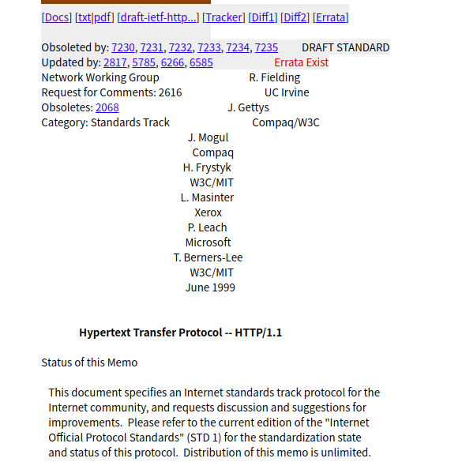

研究室の輪講でマスタリングTCP/IP入門編の一部を説明することになり、それに合わせてスライドを作成した。

この過程で学んだことを文章で残そうと思い筆を執った次第である。

- 参考文献: マスタリングTCP/IP入門編 第二章 pp60-80

## インターネット

### インターネットとは？ 

今この文章もインターネットに公開され、インターネットを介して見ていることと思うが、インターネットとはそもそも何なのだろうか。

Internet / The Internet とは、TCP/IPにより全世界を接続しているコンピュータネットワーク、ただ一つのことを指す。

語源は、「複数のネットワークを結んで1つのネットワークにする」ことを表す internet。現在ではこの意味で用いるには internetworking と表現する。

### インターネットの構造

インターネットは、小さなネットワークが相互接続し1つのネットワークを成し、これが複数接続して大きなネットワークを成し、、のように階層的な構造をもつ。

ISP (Internet Service Provider) のネットワーク内では、NOC (Network Operation Center) と呼ばれる施設を通じて接続し、ネットワークを構成している。 
ISP 同士の接続には、2者間接続を行うプライベートピアリングや、多数のISPをIX (Internet Exchange)を通じてつなぐ IPトランジット がある。

ISP以外にも、有志で運営される地域ネットといわれるネットワークも存在すると本には記載があるが、2020年現在の実態は不明。
過去にあった地域ネットとして[柏インターネットユニオン](https://ja.wikipedia.org/wiki/%E6%9F%8F%E3%82%A4%E3%83%B3%E3%82%BF%E3%83%BC%E3%83%8D%E3%83%83%E3%83%88%E3%83%A6%E3%83%8B%E3%82%AA%E3%83%B3)などがあるようだ。

## TCP/IP

TCP/IPとは、パケット交換プロトコルである IP (Internet Protocol) を利用したり、IPで通信したりするときに必要なプロトコル群の総称。

インターネットで必要なプロトコルをまとめたものであることから、インターネットプロトコルスイートとも言われる。

TCP/IPという語を使うとき、TCPプロトコルとIPプロトコルだけを指しているわけではない。

### パケット交換ネットワーク

先程出てきたパケット交換について。
パケット交換ネットワークとは、電話に用いられるような回線交換型と対比されるネットワークの形式である。

一つの回線を複数が共有して使う。 
代表的な利点として、回線の利用効率を高められること、分散型のネットワークの構築に向くことが挙げられる。

### TCP/IPの歴史

1960年代、米国防総省(TheTepertment of Defense)が中心に、分散型ネットワークによる通信技術の開発が行われた。 
その中で学術機関4ノードを結ぶ、パケット交換の実用性を試験するための分散型ネットワークARPANETが誕生した。 
ARPANETは急速に発展し、3年間で34ノードにまで拡大し、パケット交換によるデータ通信に実用性があることがわかった。

その後、単なるパケット交換通信にとどまらず、各ノードのコンピュータ間での信頼性の高い通信手段を提供する総合的な通信プロトコルが実験、開発される。これがTCP/IPとなった。 

TCP/IPは当時普及していたOSであるBSD UNIXに実装され、利用がさらに加速する。 
ARPANETは拡大し、多数のネットワークと接続するように成る。
やがてARPANETや後継のNSFnetに接続するTCP/IPによる世界的なネットワークをインターネット(The Internet)と呼ぶようになる。

1995年ごろにはISP (Internet Service Provider )が乱立し、インターネットの商用化が進む。 このような流れで今日に至り、世界中をTCP/IPによるネットワーク、インターネットが覆い尽くすようになった。

- 1960s DoDによる通信技術の研究
- 1969 ARPANETの誕生。パケット交換技術の開発
- 1972 TCP/IPの誕生
- 1975 TCP/IPの仕様決定と、TCP/IPが実装されたUNIXの提供
- 1982 ARPANETでのプロトコルがTCP/IPに統一
- 1989 LAN/WAN上でTCP/IPが普及
- 1995 インターネットの商用化が進む

### TCP/IPの標準化

TCP/IPはプロトコル群であり、通信のためには両者が同一のプロトコルを使用する必要がある。
そのためにTCP/IPにも標準が存在するが、 TCP/IPの標準化には次の2つの特徴があり、これがプロトコルの急速な実現と普及に影響した。

- オープンである
- 実用を重視する

#### 特徴:オープンである

TCP/IPの仕様を議論するIETF(Internet Engineering Task Force)のメーリングリストには自由に参加できる。

また仕様や実装も公開されており、自由にアクセスできることもオープンであるという特徴を表している。

画像は[IETFのあるWebページ](https://www.ietf.org/how/lists/)の冒頭部分である。
画像下部分に書かれているように、IETFの議論には、どんな個人でも参加できる。
このページの更に下に行くと、実際にメーリングリストに参加する手順が書かれていた。

#### 特徴:実用を重視する

TCP/IPは仕様策定時に実装することを念頭において進む。
プロトコルの詳細仕様を決める際には、既に通信できる実装が存在し、標準になる頃には既に製品に実装されている。

画像はTCP/IP標準化の手続きを図示したものである。

以上のように、TCP/IPの標準化手続きには特徴がある。
普及した要因に、他のプロトコルと比べ、実用を重視したことで動作するプロトコルをはやく作れたこと、オープンな仕様策定の仕組みにより急速な技術革新に対応できたことが考えられる。

#### TCP/IPの仕様

標準化しようとするプロトコルはRFC(Request For Comments)と呼ばれるドキュメントになり、通し番号をつけてインターネット上で公開される。仕様書だけでなく、実装や運用、実験に関する情報を含む。
RFCは番号をがつけられていて、一度RFCになると改定することはない。
RFCは[Webページから入手](http://rfc-editor.org/rfc)できる。
そのため通し番号は大きくなり、プロトコルごとに番号の統一性があるわけでもないので、複数のRFCを指すSTD(STanDard), FYI(For Your Information)などの文書単位もある。

画像は[RFC2616](https://tools.ietf.org/html/rfc2616)の冒頭である。

### TCP/IPの階層モデル

TCP/IPモデルは階層構造になっている。
ネットワークの信頼のある通信を実現するには様々な機能を実装せねばならないので、各層に分けて他層を抽象化することが現実的には必須。

TCP/IPが普及したのは、IPが動作すればそれより下位層は何を使っても良い、TCP/UDP上で動作すればそれより上位のアプリケーションはなんでも良いという柔軟性も理由の一つである。

以下では、OSI参照モデルとTCP/IP階層モデルの対応を示した後、下位層から順に、代表的なプロトコルを示す。

#### OSI参照モデルとの対応

TCP/IPの階層モデルは、アプリケーション層、トランスポート層、インターネット層、リンク層の4階層から成る。
OSI参照モデル7階層に完全に対応するものではないが、対応するとしたらつぎのようになる。

| OSI参照モデル | TCP/IP階層モデル |
| --- | --- |
| アプリケーション層 | アプリケーション層 |
| プレゼンテーション層 | ^ |
| セッション層 | ^ |
| トランスポート層 | トランスポート層 |
| ネットワーク層 | インターネット層 |
| データリンク層 | リンク層 |
| 物理層 | (ハードウェア) |

#### ハードウェア

OSI参照モデルで物理層に当たる部分である。

ハードウェアついては、TCP/IPプロトコルでは特に指定されていない。
通信する上での信頼性、セキュリテイ、帯域、遅延、無線/有線、電話回線やイーサネットなど、物理的なものには拘束されず、ネットワークで接続された装置間で通信できればよい。

余談だが、 TCP/IPにおけるハードウェアとして伝書鳩を用いることもできる。
RFCにも、[RFC1149 鳥類キャリアによるIPデータグラムの伝送企画](https://tools.ietf.org/html/rfc1149)としてきちんと仕様が存在する。

これはエイプリルフールに作られたようだが、このような<strike>ふざけた</strike>お茶目なRFCは次のように他にもある。

- [RFC2322 洗濯バサミDHCPによるIPアドレスの管理手法](https://tools.ietf.org/html/rfc2322)([邦訳](http://www.kt.rim.or.jp/~ksk/joke-RFC/rfc2322j.txt))
- [RFC2324 ハイパーテクストコーヒーポット制御プロトコル](https://www.ietf.org/rfc/rfc2324.txt)など。

等。 鳩を用意するのは厳しいが、後者2つは実装してみたい気もする。

 

#### リンク層

ネットワークインタフェース層とも。(マスタリングTCP/IP入門編より)

デバイスドライバが実装にあたる。(マスタリングTCP/IP入門編より)
ハードウェアの違いを吸収し、上位層でIPが使える必要がある。

PPP(Point to Point Protocol)もここに含まれる。

#### インターネット層

##### IP (Internet Protocol)

##### ICMP (Internet Control Message Protocol)

##### ARP (Address Resolution Protocol)

#### トランスポート層

##### TCP
##### UDP

#### アプリケーション層

##### WWW
##### 電子メール
##### ファイル転送
##### 遠隔ログイン
##### ネットワーク管理

### 実際の通信

## まとめ

- インターネットはTCP/IPで接続される世界全体のネットワークのこと
- TCP/IPはIPをはじめとするプロトコル群
- TCP/IPはオープンな議論で, 実用重視の仕様策定を行っている
- TCP/IPの各プロトコルは階層モデルでわけることができる
 

