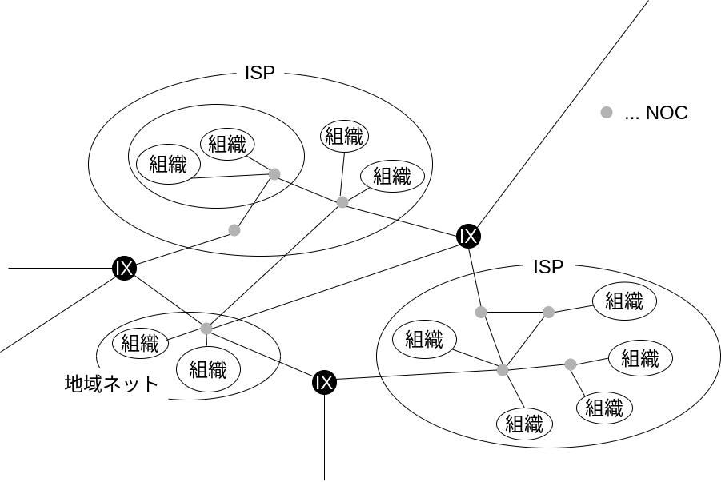
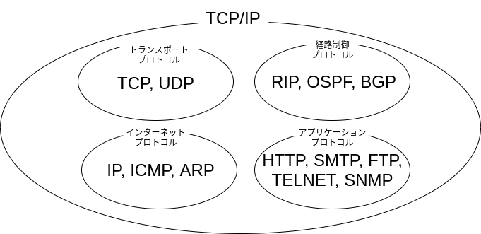
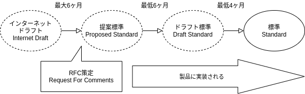
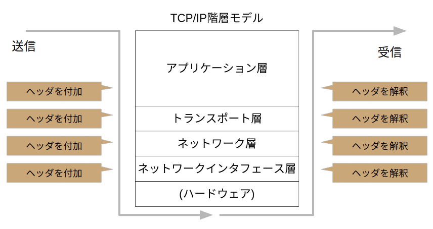

今日のインターネットの根幹をなすTCP/IPについての基本的な知識を説明する。

研究室の輪講で「マスタリングTCP/IP 入門編」を読んだことがきっかけ。

- 参考文献: マスタリングTCP/IP入門編 第二章 pp60-80

## インターネット

今この文章もインターネットに公開され、インターネットを介して見ていることと思うが、インターネットとはそもそも何を指すのか。

Internet / The Internet とは、TCP/IPにより全世界を接続しているコンピュータネットワーク、ただ一つのことを指す。

語源は「複数のネットワークを結ぶ」ことを表す internet。
現在ではこの意味は internet ではなく internetworking という言葉で表される。

### インターネットの構造

インターネットは、小さなネットワークが相互接続し1つのネットワークを成し、これが複数接続して大きなネットワークを成し、、のように階層的な構造をもつ。

ISP (Internet Service Provider) のネットワーク内では、NOC (Network Operation Center) と呼ばれる施設を通じて接続し、ネットワークを構成している。 
ISP 同士の接続には、2者間接続を行うプライベートピアリングや、多数の ISP を IX (Internet Exchange) を通じてつなぐ IP トランジットがある。

画像はインターネットの構造を表した図。

ISP 以外にも有志で運営される地域ネットといわれるネットワークも存在すると本に記載があるが、2020年現在の実態は不明。
過去にあった地域ネットとして[柏インターネットユニオン](https://ja.wikipedia.org/wiki/%E6%9F%8F%E3%82%A4%E3%83%B3%E3%82%BF%E3%83%BC%E3%83%8D%E3%83%83%E3%83%88%E3%83%A6%E3%83%8B%E3%82%AA%E3%83%B3)などがあるようだ。

## TCP/IP

TCP/IP とは、パケット交換プロトコルである IP (Internet Protocol) を利用したり、 IP で通信したりするときに必要なプロトコル群の総称のことである。
インターネットで必要なプロトコルをまとめたものであることから、インターネットプロトコルスイートとも言われる。
TCP/IP という語を使うとき、 TCP プロトコルと IP プロトコルだけを指しているわけではない。

### パケット交換ネットワーク

先程出てきたパケット交換について。
パケット交換ネットワークとは、電話に用いられるような回線交換型と対比されるネットワークの形式である。

一つの回線を複数が共有して使う。 
代表的な利点として、回線の利用効率を高められること、分散型のネットワークの構築に向くことが挙げられる。

### TCP/IP の歴史

1960年代、米国防総省 (The Depertment of Defense) が中心に、分散型ネットワークによる通信技術の開発が行われた。 
その中で学術機関4ノードを結ぶ、パケット交換の実用性を試験するための分散型ネットワーク ARPANET が誕生した。 
ARPANET は急速に発展し、3年間で34ノードにまで拡大し、パケット交換によるデータ通信に実用性があることがわかった。

その後、単なるパケット交換通信にとどまらず、各ノードのコンピュータ間での信頼性の高い通信手段を提供する総合的な通信プロトコルが実験、開発される。これがTCP/IPとなった。 

TCP/IP は当時普及していた OS である BSD UNIX に実装され、利用がさらに加速する。 
ARPANET は拡大し、多数のネットワークと接続するようになる。
やがて ARPANET や後継の NSFnet に接続する TCP/IP による世界的なネットワークをインターネット (The Internet) と呼ぶようになった。

1995年ごろには ISP (Internet Service Provider) が乱立し、インターネットの商用化が進む。
このような流れで今日に至り、世界中を TCP/IP によるネットワークであるインターネットが覆い尽している。

- 1960s DoD による通信技術の研究
- 1969 ARPANET の誕生。パケット交換技術の開発
- 1972 TCP/IP の誕生
- 1975 TCP/IP の仕様決定と、 TCP/IP が実装された UNIX の提供
- 1982 ARPANET でのプロトコルがTCP/IPに統一
- 1989 LAN/WAN 上で TCP/IP が普及
- 1995 インターネットの商用化が進む

### TCP/IP の標準化

TCP/IP はプロトコル群であり、通信のためには両者が同一のプロトコルを使用する必要がある。
そのためにTCP/IP にも標準が存在するが、 TCP/IP の標準化には次の2つの特徴があり、これがプロトコルの急速な実現と普及に影響した。

- オープンである
- 実用を重視する

#### 特徴:オープンである

TCP/IP の仕様を議論する IETF (Internet Engineering Task Force) のメーリングリストには自由に参加できる。

また仕様や実装も公開されており、自由にアクセスできることもオープンであるという特徴を表している。

画像は[IETF のあるWebページ](https://www.ietf.org/how/lists/)の冒頭部分である。
画像下部分に書かれているように、IETF の議論には、どんな個人でも参加できる。
このページの更に下に行くと、実際にメーリングリストに参加する手順が書かれていた。

#### 特徴:実用を重視する

TCP/IP は仕様策定時に実装することを念頭において進む。
プロトコルの詳細仕様を決める際には既に通信できる実装が存在し、標準になる頃には既に製品に実装されている。

画像はTCP/IP 標準化の手続きを図示したものである。

以上のように、TCP/IP の標準化手続きには特徴がある。
普及した要因に、他のプロトコルと比べ、実用を重視したことで動作するプロトコルをはやく作れたこと、オープンな仕様策定の仕組みにより急速な技術革新に対応できたことが考えられる。

#### TCP/IP の仕様

標準化しようとするプロトコルは RFC (Request For Comments) と呼ばれるドキュメントになり、[インターネット上で公開](http://rfc-editor.org/rfc)される。
仕様だけでなく、実装や運用、実験に関する情報を含む。

RFC には番号をがつけられており、一度 RFC になると改定することはない。
拡張や廃止、新規のプロトコルを定める際には新たな RFC として公開される。
そのため通し番号は大きくなり、プロトコルごとに番号の統一性があるわけでもないので人間にはわかりづらいところがある。
これを助けるため、複数の RFC を指す STD (STanDard), FYI (For Your Information) などの文書単位もある。

画像は [RFC2617](https://tools.ietf.org/html/rfc2616) の冒頭である。

### TCP/IP の階層モデル

TCP/IP モデルは階層構造になっている。
ネットワークの信頼のある通信を実現するには様々な機能を実装せねばならないので、各層に分けて他層を抽象化することが現実的には必須。

TCP/IP が普及した理由の一つに柔軟性が挙げられる。
IP が動作すればそれより下位層は何を使ってもよいし、 TCP / UDP 上で動作すればそれより上位のアプリケーションはなんでもよいのである。

以下では、 OSI 参照モデルと TCP/IP 階層モデルの対応を示した後、下位層から順に、代表的なプロトコルを示す。

#### OSI 参照モデルとの対応

TCP/IP の階層モデルは、アプリケーション層、トランスポート層、インターネット層、リンク層の4階層から成る。
OSI 参照モデル7階層に完全に対応するものではないが、対応するとしたらつぎのようになる。

#### ハードウェア

OSI 参照モデルで物理層に当たる部分である。

ハードウェアついては、 TCP/IP プロトコルでは特に指定されていない。
通信する上での信頼性、セキュリテイ、帯域、遅延、無線/有線、電話回線やイーサネットなど、物理的なものには拘束されず、ネットワークで接続された装置間で通信できればよい。

余談だが、 TCP/IP におけるハードウェアとして伝書鳩を用いることもできる。
RFC にも、[RFC1149 鳥類キャリアによるIPデータグラムの伝送企画](https://tools.ietf.org/html/rfc1149)としてきちんと仕様が存在する。

これはエイプリルフールに作られたようだが、このような<strike>ふざけた</strike>お茶目な RFC はジョーク RFC と呼ばれ、他にも次のようなものがある。

- [RFC2322 洗濯バサミDHCPによるIPアドレスの管理手法](https://tools.ietf.org/html/rfc2322)([邦訳](http://www.kt.rim.or.jp/~ksk/joke-RFC/rfc2322j.txt))
- [RFC2324 ハイパーテクストコーヒーポット制御プロトコル](https://www.ietf.org/rfc/rfc2324.txt)

等。 鳩を用意するのは厳しいが、後者2つは実装してみたい気もする。

 

#### リンク層

ネットワークインタフェース層とも。(マスタリングTCP/IP入門編より)

デバイスドライバが実装にあたる。(マスタリングTCP/IP入門編より)
ハードウェアの違いを吸収し、上位層で IP が使えるようにする。

PPP (Point to Point Protocol) もここに含まれる。

#### インターネット層

OSI 参照モデルの下から3番目であるネットワーク層に対応する。

経路制御を行う。
通信したいホスト間のデータリンクを上位層へ隠し、実際は Hop-by-Hop で行われている通信を End-to-End で行われているようにみせる役割がある。

代表的な3つのプロトコルを紹介する。

##### IP (Internet Protocol)

パケットを転送するために用いられる、インターネット層で代表的なプロトコル。
IP アドレスでホストを識別し、通信相手までパケットを配送する。
通信経路の確立を行うが、データが正しく送られる保証はない。

##### ICMP (Internet Control Message Protocol)

IP によるパケット転送に誤りがあったり、失敗したときにこれを通知するために用いられる。
他に、ネットワークが正常に通信できるか診断する機能ももつ。
ping コマンドや traceroute コマンドなどは ICMP パケットを送信することで実現している。

##### ARP (Address Resolution Protocol)

IP アドレスと MAC アドレスの対応関係を取得するためのプロトコル。IP が目的地へ通信するために、ARP を用いて途中の各通信経路の解決が行われる。

#### トランスポート層

OSI 参照モデルの下から4番目であるトランスポート層に対応する。
アプリケーション間のプログラムの通信を実現し、場合によってはデータの到達性も保証する。

##### TCP (Transmission Control Protocol)

コネクション型のプロトコル。
データの到達性を保証し、再送制御や輻輳制御を行う。
コネクションの確立に3パケット、切断に4パケットの通信が少なくとも必要である。

##### UDP (User Datagram Protocol)

コネクションレス型のプロトコル。
データの到達性を保証しない。
パケット数の少ない通信、2者間ではないブロードキャスト/マルチキャスト通信, データが多少抜け落ちても問題ない動画や音声の通信に向く。

#### アプリケーション層

OSI 参照モデルの5-7階層に相当する。
TCP/IP上では様々なアプリケーションを動かすことができる。
以下では、それぞれのアプリケーションごとに使われるプロトコルを紹介する。

##### WWW (World Wide Web)

HTML (Hyper Text Markup Language) 文書をはじめとするデータを、Webブラウザを介して HTTP (Hyper Text Transfer Protocol) / HTTPS ( - Secure) で受信し閲覧する。

(QUIC などの例外を除いて)主に TCP 上で動作する。

##### 電子メール

MIME (Multipurpose Internet Mail Extensions) (マイム)形式のデータを、専用のプロトコルを用いて送受信する。

メールの送受信には SMTP (Simple Mail Transfer Protocol), POP3 (Post Office Protocol version 3), IMAP (Internet Message Access Protocol)などが用いられる。

送信者はメールを SMTP サーバを経由して相手方の POP3 / IMAP サーバへ送信する。
受信者は POP3 / IMAP サーバよりメールを受け取る。

TCP 上で動作する。

##### ファイル転送

FTP (File Transfer Protocol) / SFTP (Secure - )によりファイルを送受信する

TCP 上で動作する。

##### 遠隔ログイン

TELNET (TELetypewriter NETwork) や SSH (Secure SHell) を用いて離れたコンピュータにログインする。

Linux で GUI を実現するためによく用いられる X Window System の X Protocol も TCP/IP 上で実現している。

TELNET や SSH 等は TCP 上で動作する。
X Protocol の中でも XDMCP (X Display Manager Control Protocol) は UDP。

##### ネットワーク管理

SNMP (Simple Network Management Protocol) など。

ネットワーク上のルータやスイッチなどの管理対象(SNMP エージェント)を管理端末(SNMP マネージャ)が管理する。
パケットの量や機器の温度などを管理できる。
ネットワーク機器の動作を妨げないため、また通信に必要なパケットが少ないため、UDP で動作する。

### 実際の通信

通信を行う際、送信側は上位層から順にその層で必要となる管理情報を含むヘッダを付加してカプセル化する。
受信側は下位層から順にヘッダを解釈して除去し上位層に渡す。

例えばWebページを閲覧する際は、サーバ側で HTML 文書に HTTP ヘッダを付加し、  TCP ヘッダを付加し、 IP ヘッダを付加し、イーサネットフレームのヘッダを付加し送信される。
クライアントはイーサネットフレームのヘッダを解釈し、 IP ヘッダを解釈し、 TCP ヘッダを解釈し、 HTTP ヘッダを解釈し、 HTML 文章を画面に描画する。

## まとめ

以上の内容をまとめると次のようになる。

- インターネットは TCP/IP で接続される世界全体のネットワークのこと
- TCP/IP は IP をはじめとするプロトコル群
- TCP/IP はオープンな議論で, 実用重視の仕様策定を行っている
- TCP/IP の各プロトコルは階層モデルでわけることができる

ネットワーク全体について俯瞰して振り返ることはあまりないので、スライドを作ったのに合わせて文章にも起こしてみた。
こういった復習を多く含む地道な勉強も、怠らずにやっていきたい。

---

追記: (2020/10/04) 不要な改行タグを削除
