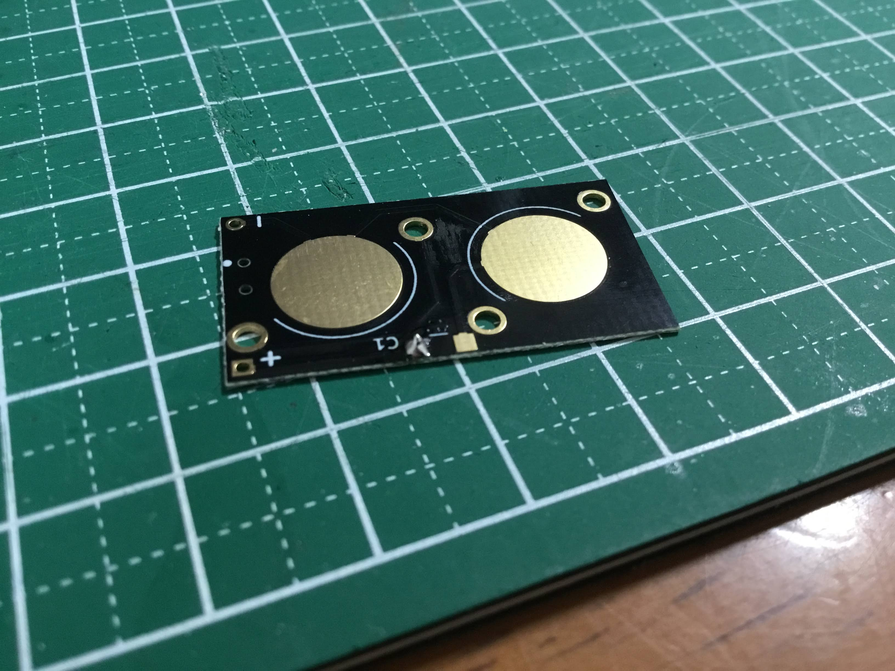
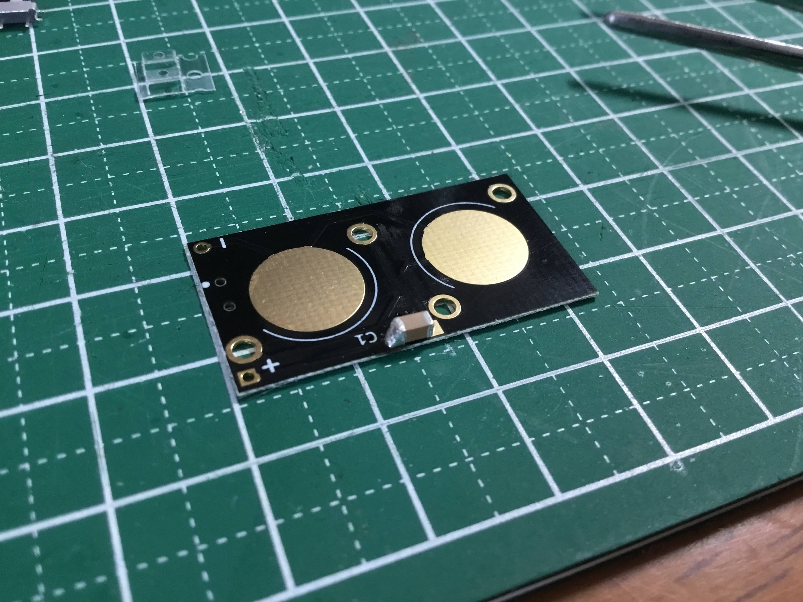
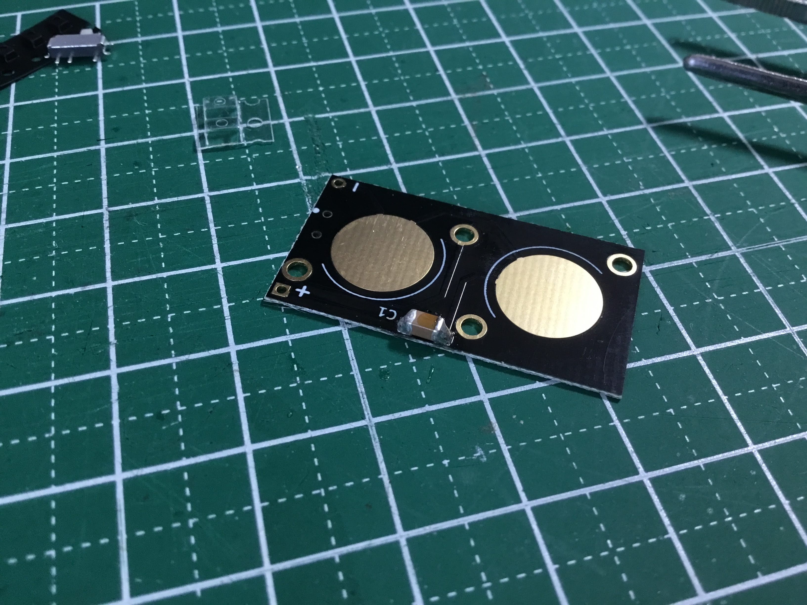
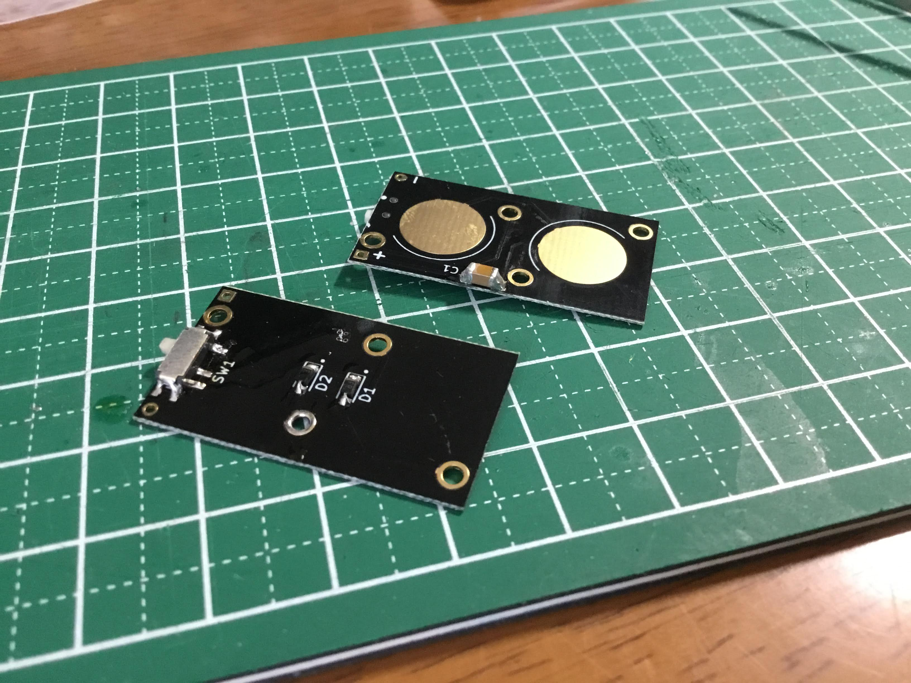
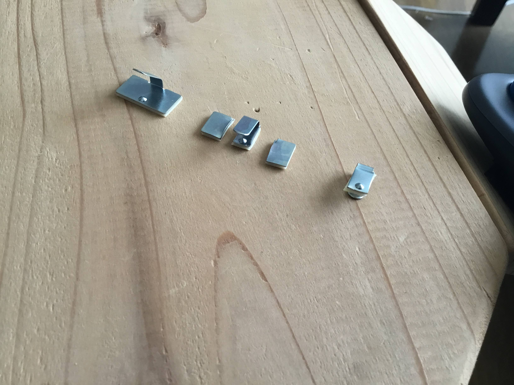
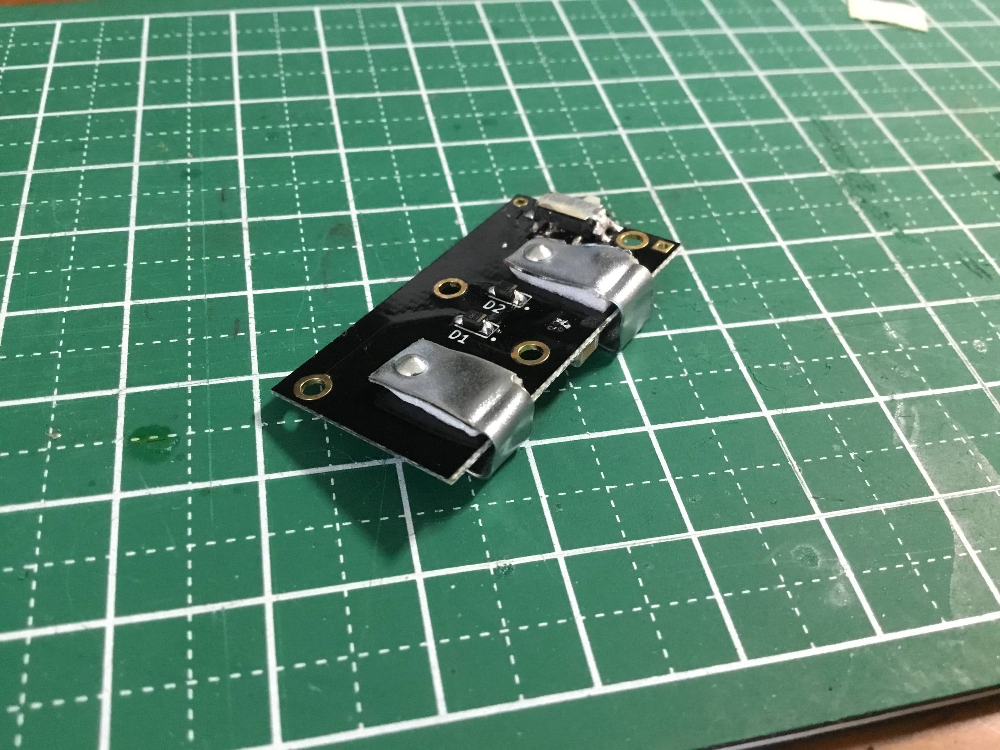
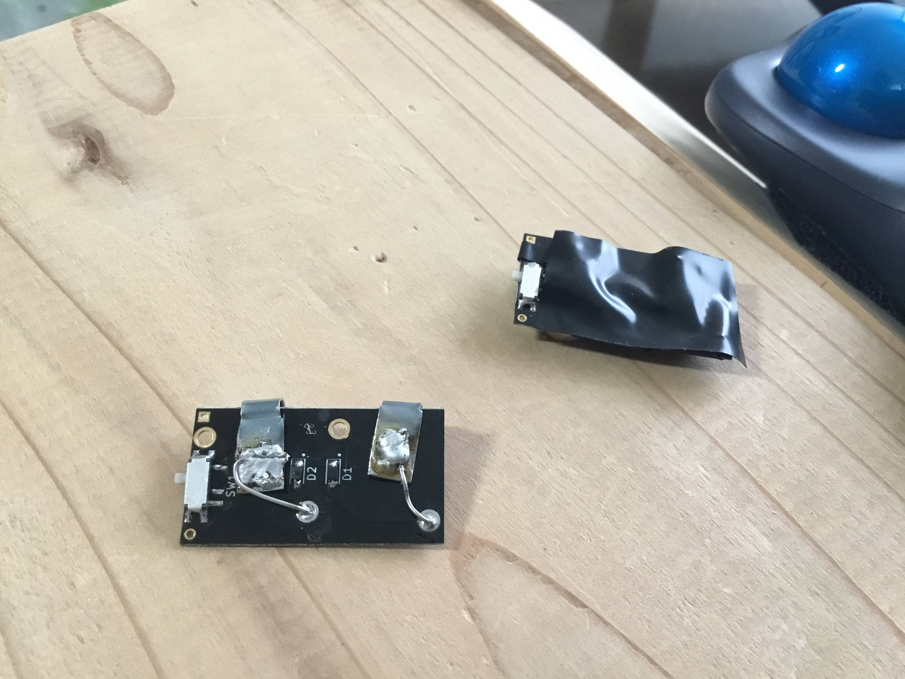
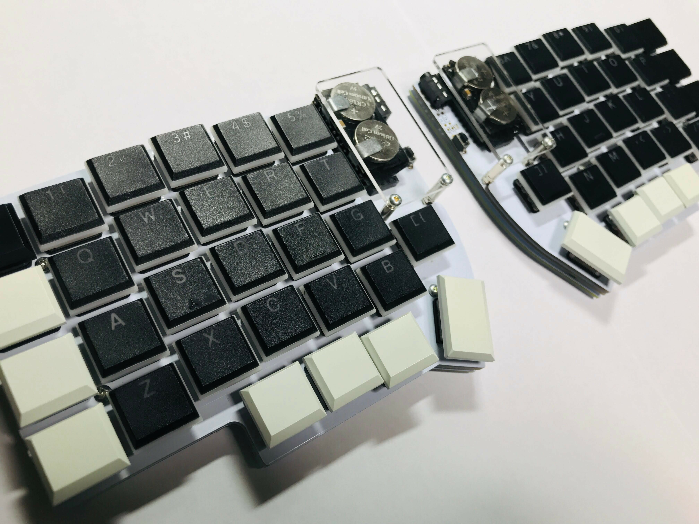

[前回の記事で作った](https://memo.basd4g.net/posts/lily58-pro-build-log/)左右分割型の自作キーボード [Lily58 Pro](https://yuchi-kbd.hatenablog.com/entry/2018/12/23/214342) を Bluetooth に対応させ、無線で PC に接続できるように改造した。
その作業記録。

この記事では、無線化にあたり次のことを行う。

- USBからキーボードへの給電がなくなるので、別途[ボタン電池用の電源基板](https://yushakobo.jp/shop/ble-micro-pro-battery-board/)をつなぐ
- 有線キーボードの制御用マイコンである Pro Micro を、Bluetooth に対応した [BLE Micro Pro](https://github.com/sekigon-gonnoc/BLE-Micro-Pro) に交換する
- BLE Micro Pro にファームウェアを書き込む

## 必要なもの

- Lily58 Pro ([遊舎工房](https://yushakobo.jp/shop/lily58-pro/))
- Pro Micro 互換の Bluetooth-LowEnergy 対応マイコン([遊舎工房](https://yusahakobo.jp/shop/ble-micro-pro/)|[Booth](https://nogikes.booth.pm/items/1177319)) x2
- 上記マイコン用ボタン電池基板 ([遊舎工房](https://yushakobo.jp/shop/ble-micro-pro-battery-board/)|[Booth](https://nogikes.booth.pm/items/1655285)) x2
- 上記の互換ボードを Lily58 に PCB に固定するためのコンスルー 12ピン ([遊舎工房](https://yushakobo.jp/shop/a01mc-00/))
- ボタン電池 CR1632 x4
- (電池ホルダーを紛失したので) 100均に売っている金属製のコードホルダー x4
- (電池ホルダーを紛失したので) 上記と基板をつなぐスズメッキ線
- マイコンと電池基板をつなぐICピン 長さ1ピン x4
- 絶縁用ビニールテープ
- はんだ、はんだごて、はんだ吸い取り線、ピンセット等

## 手順

手順を示した[公式ガイド](https://sekigon-gonnoc.github.io/BLE-Micro-Pro/#/getting_started)に従って作業を進めた

### 1. Lily58 Pro を完成させる

Pro Microはコンスルーを使って組み立て、交換できるようにしておく

### 2. 電池基板の組み立て

#### 2.1. コンデンサ, スイッチ, ダイオードの取り付け

電池基板に付属の電子部品をはんだ付けする。

はんだ付けの手順は以下の通り。Lily58 Proの部品をはんだ付けしたのと同じように行えばよい。
写真はコンデンサを固定するときのものである。

1. まず基板のランドの片方を温めて半田をつける

2. 先程つけた半田を溶かして部品の片方を固定する

3. まだ半田を流していない側の端子とランドを温めて半田をつける

コンデンサは極性がないのでどちら向きにつけてもよい。

ダイオードはコンデンサと反対の面につける。
極性があるので注意。
ダイオードの表面に線が入っており、線が近い方の端子がプラス。
これを基板のシルク印刷(丸ポッチがある方)に合わせる。

組み立てると次のようになる。

#### 2.2. 電池固定用ホルダーの取り付け

今回は(届いたときに内容物を確認していなかったがおそらく)この部品を紛失したため、電池が固定できそうな金属部品を探して代用した。

それがダイソーのコードホルダー。
これの左右を切り落として、コの字のパーツを作り、折り曲げる。

次に、完成時に電池と基板を挟み込むように、基板の電池を固定するのと反対側の面に、金具を金具に付属の粘着テープで固定する。

そのあと、基板のホールと金具をスズメッキ線で結線する。

最後に電池を取り付けてテスターで3Vが得られることを確認したら、全体をビニールテープで絶縁する。

### 3. BLE Micro Pro の組み立て

BLE Micro Pro にコンスルーを取り付ける。はんだ付けの必要はないと書いてあったがなんとなく半田を流しておいた。

その後、ピンヘッダを1本だけの長さにして、電池基板を BLE Micro Pro につなげる。

最後に BLE Micro Pro を Lily58 に刺して完成。

### 4. ファームウェアの書き込み

事前に 電池基板のスイッチを切っておいたほうがわかりやすい。
Lily58 Pro に固定した状態で左右の基板ともに、左にスイッチを倒すとOFF。

BLE Pro Micro は [専用の Web Configurator](https://sekigon-gonnoc.github.io/home#/keymap) という Chrome 上で動く Webアプリで書き込むのが一番簡単な方法らしい。

1. Chrome の設定変更
`chrome://flags#enable-experimental-web-platform-features` を開き Experimental Web Platform features を Enabled にする。

2.  [専用の Web Configurator](https://sekigon-gonnoc.github.io/home#/keymap) にアクセスする
3. ナビゲーション付きでセットアップを開始する
4. キーボードの選択画面で Lily58 の rev1 を選ぶ Disable Mass storage Class と Use with LPME-IO のチェックは入れない
5. 最新のブートローダー (記事執筆時は0_7_1) 選び Update
6. デバイスを選択する画面が出てくるので, BLE Micro Pro を PC と USBで接続する。
  BLE Micro Pro(新しく増えたデバイス)を選択。
  筆者の環境(Macbook Air 2018 Catarina)では `IOUSBHostDevice (tty.usbmodem0000000000011)` と `IOUSBHostDevice (cu.usbmodem0000000000011)`が出現したが、後者を選ぶと書き込めた。

7. アプリケーション(必ずブートローダー同じバージョンのもの)を書き込む。Is Left のみにチェックが入っていること。
8. もう一つの BLE Micro Pro も同様に書き込む。アプリケーション書き込み時に Is  Slave のみにチェックが入っていること。

### 5. キーマップの書き込み

1. [専用の QMK Configurator](https://sekigon-gonnoc.github.io/qmk_configurator/#/) にアクセスする。
2. BLE Micro Pro を PC に USB 接続した状態で、CONNECT BY SERIAL ボタンを押す。
3. キーボードリストから lily58/rev1 を選択する。
4. 好みのキーマップを作成する。
5. KEYMAP.JSON の左側のボタンを押してキーボードに反映
6. そのまま試しにキーを打ってみて問題なさそうであれば、SAVE KEYMAP ボタンでキーボードに保存。
7. USBを抜いて、PCと BLE Micro Pro を切り離す

### 6. キーボードを実際に使う

左右どちらも電池基板の電源を入れると、勝手に左右がペアリングする。
PC の Bluetooth 設定ページを見ると Lily58 が出現しているので選択すると PC とのペアリングが完了し使えるようになる。

## 感想

- 公式のドキュメントと、他の分割キーボードの Bluetooth 化の記事を見ながら進めた。
- 電池ホルダーがないことに気づいたときは凹んだが、完成品は特に不自然なく動作させられてよかった。
- QMK をビルドして書き込む方法はうまく行ってないので、また必要になる時があったら試してみることとする。
- Web アプリの QMK Configurator はよくできていて、キーの長押しで動作を変えるといった機能にも対応しているのでひとまずは普通に使えている。
- キーボードのペアリングはとてもスムーズだったし、ペアリング後も電源を入れるとすぐにPCとつながるのでとても快適に使うことができている。
- いまのところ一日に一回くらい、キーが押しっぱなしになる(キーを押して無いのにキーコードが送信され続ける)ことがあり、キーボードの電源を一旦切ることで解決している。原因は不明。 今後も継続して発生するようであれば、これの原因究明もせねばならない。

こんなところかな。

自作キーボードとはいえ、普通に問題なく使える快適なものが出来上がってとても満足だ。
キーボードや無線化キットを設計したり情報をまとめたりしてくれている方々に感謝したい。

両手で1万円くらいかけてわざわざ無線化したのは理由があるのだが、それはまた別記事で紹介することとする。
