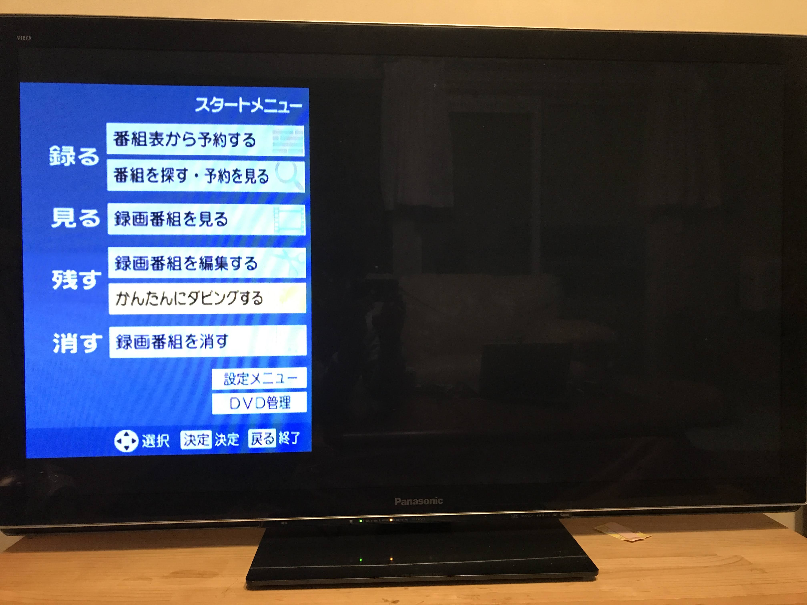
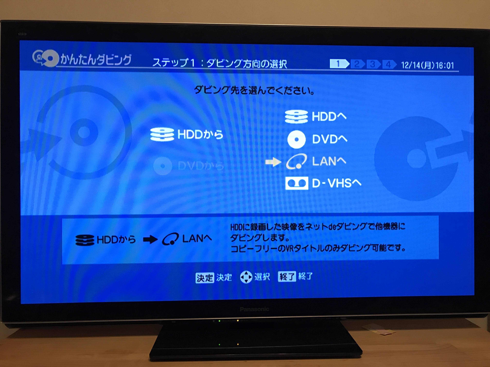
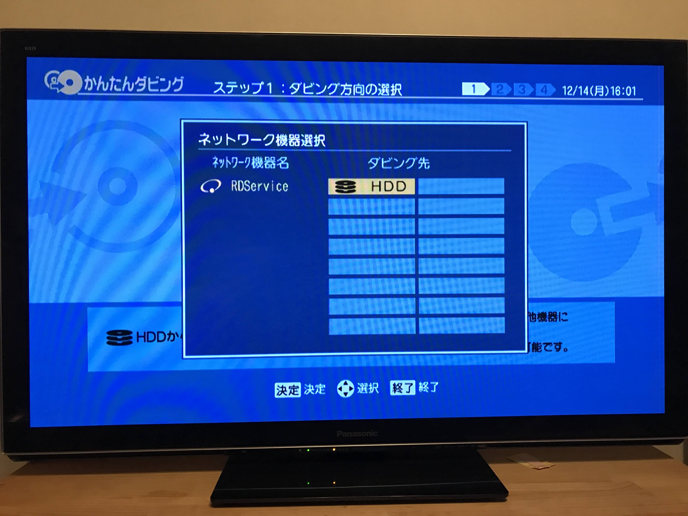
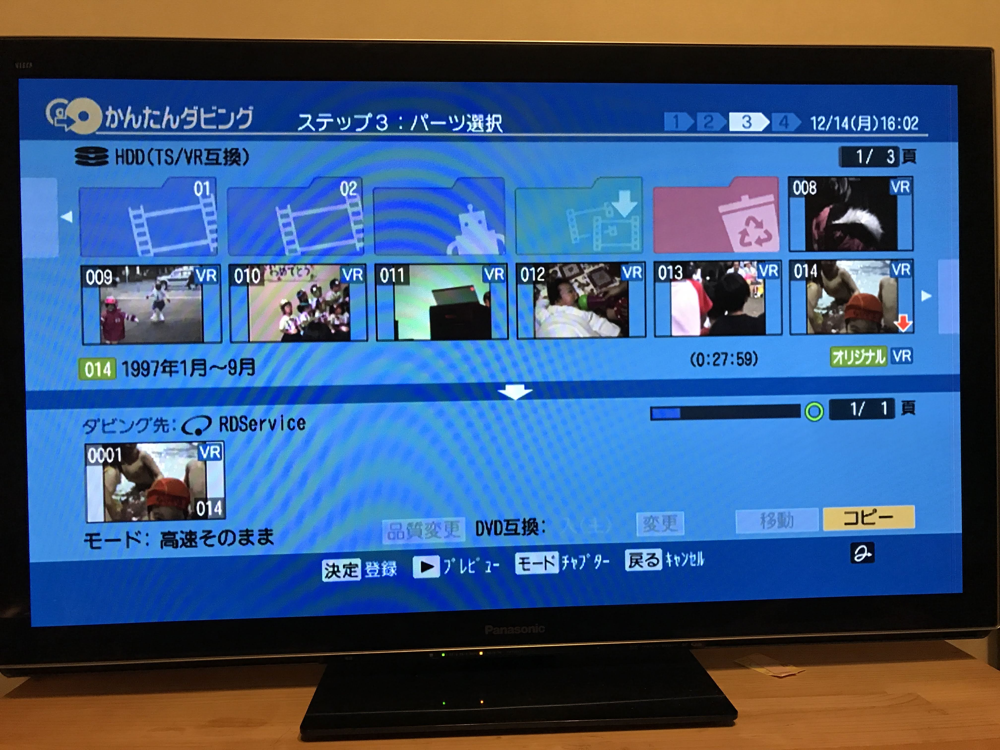
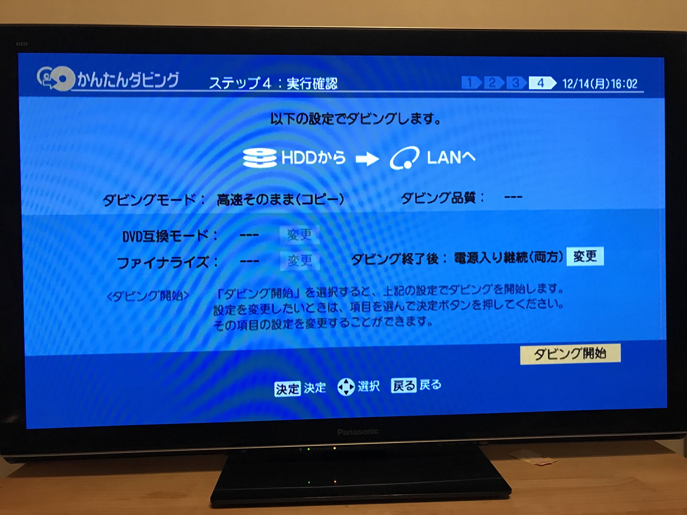

TL;DR: 2006年製の東芝製 HDD レコーダ RD-S600 の動画を, 当該機種に搭載の「ネットdeダビング」機能を使って, LAN 経由で macOS のストレージにコピーする.

## 背景

8ミリのビデオテープや VHS に記録されたホームビデオをデジタル化するにあたり, 家族が自宅にあった HDD レコーダ RD-S600 の内蔵 HDD に動画を録画していた.

これを, HDDの寿命が怖いしブルーレイに焼きたかったりするのでPCに転送したい.

RD-S600 は2006年東芝製の HDD レコーダで, 都合のいいことにイーサネットポートがついているため LAN 内で動画を転送できる.
ただし転送できるのはコピー制限のかかっていない VR モードの動画に限る. (アナログ入力の録画に使われる低品質のもの)

転送を受けるPC側については, 有志で公開されたソフトを利用する.
ただし15年ほど前ということもありリンク切れで入手できなかったり当時のOS上で動くことを前提にしていたりするので, 2020年現在で出来そうな方法を探した.

いくつかあるソフトの中で試行錯誤の結果, 今回はJava製でMac OS X 向けの転送用ソフトウェア [RDService](http://raktajino.sakura.ne.jp/RDService/RDService.html) を利用した.

## 環境

- 東芝製 HDD レコーダ RD-S600
- MacBook Pro 2020 (Catalina)
- どちらも同じLAN に接続する (HDD レコーダはイーサネットポートを利用して有線で, MacBook はアクセスポイントを経由して無線で接続)
- 2台とも DHCP を利用(勝手に探してくれるのでIPアドレスはなんでもよい)

## 手順

Mac で FTP を拡張したサーバを実行し, 同じネットワークに接続した HDD レコーダ側を操作して, サーバに動画を転送する.

### 1. Java8 をインストール

```sh
# homebrew がインストールされていることを前提とする
# Java8 をインストール
brew tap homebrew/cask-version
brew install --cask zulu

# java が zulu8 のバージョンであるかを確認する. zulu8 でないときは参考 URL より切り替えるとよさそう.
java -version
```

参考: [MacのBrewで複数バージョンのJavaを利用する + jEnv - Qiita](https://qiita.com/seijikohara/items/56cc4ac83ef9d686fab2)

私の環境では zulu8 が `/Library/Java/JavaVirtualMachines/zulu-8.jdk/Contents/Home/bin/java` にインストールされていた.
のちほどシェルスクリプトで実行する java コマンドの代わりに上記のパスを指定しても良い.

### 2. RDService をダウンロード

```sh
curl -o RDService.zip http://raktajino.sakura.ne.jp/RDService/RDService_1.0b5.zip
unzip RDService.zip
cd RDService
```

### 3. RDService を実行

```sh
./RDService
```

解凍したディレクトリの中にあるシェルスクリプト `RDService` を実行すると, サーバが起動する.
RDService は 21, 5500-5509 ポートを利用するので, 既に利用しているアプリケーションがあったら事前に落として開放しておく.

デフォルトでは `~/Movies` に転送した動画を保存するので, シェルスクリプトを編集して NAS や 外付けHDD 等の大容量ストレージを指定するとよさそう.

### 4. HDD レコーダ側を操作して転送を開始する

ネットワークに接続されていない場合は事前に接続しておくこと.

この項では東芝HDDレコーダをリモコンを次のように操作する.

```
スタートメニュー > かんたんにダビングする > HDD から LAN へ > コピーする動画を選ぶ > コピー
```

選択する項目の画面は下に示す.


リモコンで「スタートメニュー」を押し, 「かんたんにダビングする」を選ぶ.



次にダビング方向の選択. 「HDD から」「LAN へ」を選ぶ.



次にネットワーク機器選択をする. 「RDService」「HDD」を選ぶ.



ダビングする動画を選ぶ.



ダビング開始.



### 5. 待つ

途中で Mac がスリープしないように注意.

あと時々転送に失敗するので, その時は転送された動画の書き出し状況を確認し適宜手動でリトライする(した).
(動画を連続して転送すると1本目の動画を転送しきってからコネクションが切れることが多い気がする？...)

ちなみに RD-S600 はイーサネットポートが 10BASE-T のため, 転送にとても時間がかかる.
1.5時間の動画を転送するのに一時間くらいかかるので心して挑まなければならない.

転送が終わったかどうかは HDD レコーダ側のシーケンスバーがなくなっているかどうかで確認する.
取り出した動画はMPEGなので, あとは煮るなり焼くなりできる.

## 注意点

- Java11 ではエラーを吐くので Java8 をインストールすること
- Java8 が動けばどのOSでもよいわけではなく, MacOS X 上で行なうのが確実. 私の環境だと Ubuntu 20.04 上では RDService は起動したものの HDD レコーダから認識されなかった. (Mac OS X 上でもたまに認識されないので, もしかしたら動くかも)

## 感想

2006年製のAV製品からネットワーク経由で動画を取り出せるとは, イーサネットは素晴らしい.

転送速度が(非常に)遅いとはいえ, できるのとできないのでは大違い.
できるだけでありがたい.

この頃のAV機器の統一規格はなくて, 当時は東芝のレコーダに合わせたソフトをネット上の有志が開発していたようである.
中身はFTPサーバをベースにしたものっぽい.
14年経っても動かして助かっているので開発者に感謝.

## 参考

- [ネットdeダビング - RD-Wiki （東芝REGZAブルーレイ&VARDIAまとめサイト）](https://rdwiki.rd-style.info/wiki.php?%A5%CD%A5%C3%A5%C8de%A5%C0%A5%D3%A5%F3%A5%B0)
- [Download - RDService](http://raktajino.sakura.ne.jp/RDService/RDService.html)
- [玄箱HGに「RDService」インストール: 端っこなひとの備忘録](http://animemo.seesaa.net/article/5877115.html)
- [RDService で RD-H1 から Debian にネットワークダビング - World Wide Walker](http://yoosee.net/d/archives/2006/01/02/002.html)
- [MacのBrewで複数バージョンのJavaを利用する + jEnv - Qiita](https://qiita.com/seijikohara/items/56cc4ac83ef9d686fab2)
